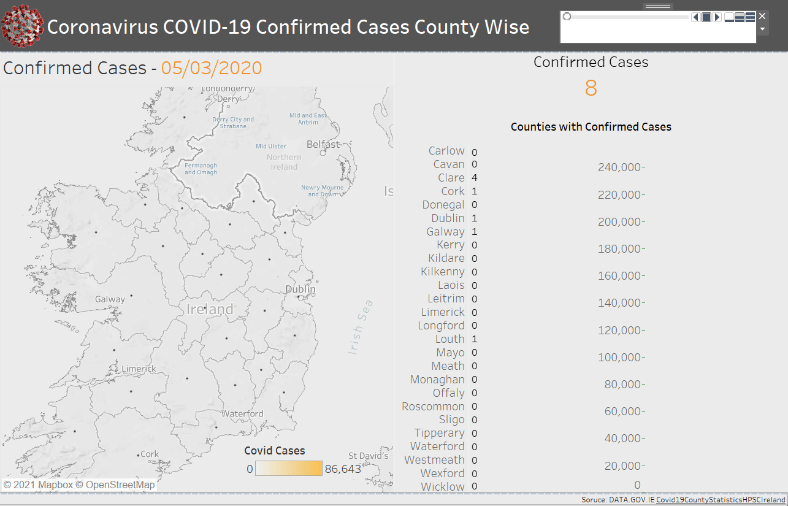
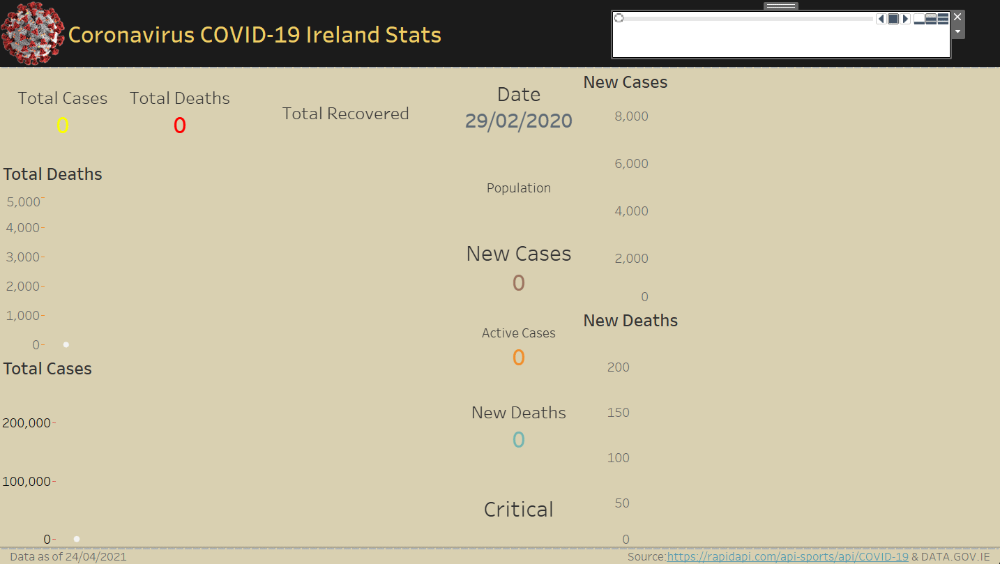

# Covid19 Visualizations

### The main objective is to collect the data related to covid19 cases of Ireland and to create a dashboard with all the possible visuals.

This developed using multiple datasets collected from https://rapidapi.com/api-sports/api/COVID-19 & DATA.GOV.IE

####  Dashboard 1 (Coronavirus COVID19 Confirmed Cases County Wise)

####  Dashboard 2 (Coronavirus COVID19 Ireland Stats)

